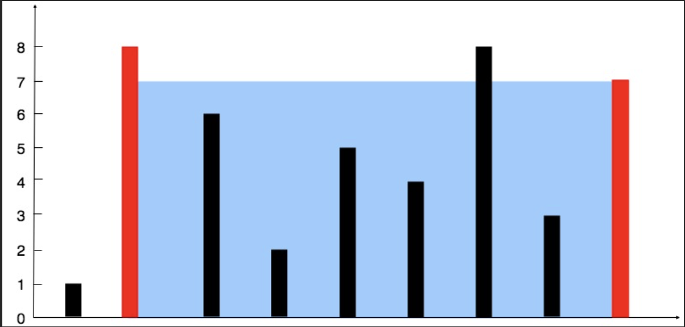

## Link
[Container With Most Water](https://leetcode.com/problems/container-with-most-water/description/) - medium
## Question
> You are given an integer array `height` of length `n`. There are `n` vertical lines drawn such that the two endpoints of the `ith` line are `(i, 0)` and `(i, height[i])`.
> Find two lines that together with the x-axis form a container, such that the container contains the most water.
> Return _the maximum amount of water a container can store_.
> 
> **Notice** that you may not slant the container.
>> <br>
>> **Input:** height = `[1,8,6,2,5,4,8,3,7]` <br>
>> **Output:** 49 <br>
>> **Explanation:** The above vertical lines are represented by array `[1,8,6,2,5,4,8,3,7]`. In this case, the max area of water (blue section) the container can contain is 49.
## Goal
- Find the maximum area of water a container can store.  The container is formed by two vertical lines from the array `height[]`, and the width is the distance between the lines.
## Logic
Two-pointer approach:
1. Start with two pointers:    
    - `left = 0` (start of array)
    - `right = len(height) - 1` (end of array)
2. While `left < right`:
    - Calculate area:  
        `area = min(height[left], height[right]) * (right - left)`
    - Update `max_area` if this area is greater.
    - Move the pointer pointing to the **shorter line**, because moving the taller line won’t help increase the area.
## Code
```python
class Solution:
    def maxArea(self, height: List[int]) -> int:
        max_area = 0
        left, right = 0, len(height) - 1
        
        while left < right:
            size = (right - left) * min(height[left], height[right])
            max_area = max(max_area, size)
            
            if height[left] < height[right]:
                left += 1
            elif height[left] > height[right]:
                right -= 1
            else:
                left += 1
                right -= 1

        return max_area
```

## Complexity analysis
- Time Complexity: O(n)
- Space Complexity: O(1)
## Pre-knowledge
- Two Pointers
