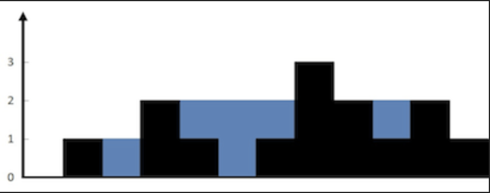

## Link
[Trapping Rain Water - LeetCode](https://leetcode.com/problems/trapping-rain-water/description/) - hard
## Question
>Given `n` non-negative integers representing an elevation map where the width of each bar is `1`, compute how much water it can trap after raining.
>
>**Example 1:**
>  <br>
> **Input:** height = `[0,1,0,2,1,0,1,3,2,1,2,1]`
> **Output:** 6
> **Explanation:** 
> 	The above elevation map (black section) is represented by array `[0,1,0,2,1,0,1,3,2,1,2,1]`. In this case, 6 units of rain water (blue section) are being trapped.

## Goal:
- We’re given an array where each element represents the height of a bar.  We need to return the **total amount of water** that can be trapped after the rain.
## Method - two pointer
### Logic
> [!note]
> - `water = min(left_max, right_max) - height[i]`
> - Using *two pointers* while `left < right`, we only consider the **minimum of `left_max` and `right_max`** to decide how much water can be trapped at the current step.
### Code:
```python
class Solution:
    def trap(self, height: List[int]) -> int:
        # min(max_left, max_right) - height
        res = 0
        left, right = 0, len(height) - 1
        max_left, max_right = height[left], height[right]
        
        while left < right:
            if height[left] < height[right]:
                left += 1
                max_left = max(max_left, height[left])
                res += max(0, max_left - height[left])
            else:
                right -= 1
                max_right = max(max_right, height[right])
                res += max(0, max_right - height[right])
                
        return res
```
### Complexity analysis
- Time Complexity: O(n)
- Space Complexity: O(1)
## Pre-knowledge
- two pointer
