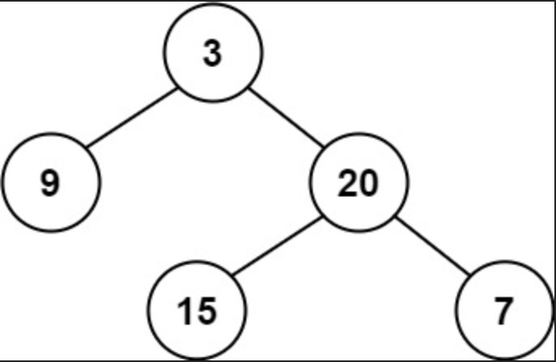

## Link
[Balanced Binary Tree - LeetCode](https://leetcode.com/problems/balanced-binary-tree/description/) - easy
## Question
>Given a binary tree, determine if it is **height-balanced**.<br>
><br>
>**Input:** root = `[3,9,20,null,null,15,7]`<br>
>**Output:** true

## Goal:

## Logic

## Code:
```python
class Solution:
    def isBalanced(self, root: Optional[TreeNode]) -> bool:
        return self.get_balanced(root) != -1

    def get_balanced(self, root):
        if not root:
            return 0
        
        left = self.get_balanced(root.left)
        right = self.get_balanced(root.right)

        if abs(left - right) > 1:
            return -1
        
        if left == -1 or right == -1:
            return -1
        else:
            return 1 + max(left, right)
```

## Complexity analysis
Time Complexity: $O(n)$ <br>
Space Complexity: $O(n)$
## Sample: 

## Pre-knowledge
- tree
