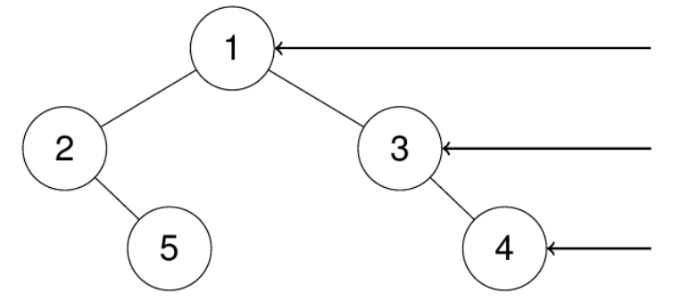

## Link
[N-Queens II - LeetCode](https://leetcode.com/problems/n-queens-ii/description/) - hard
## Question
>The **n-queens** puzzle is the problem of placing `n` queens on an `n x n` chessboard such that no two queens attack each other.
>Given an integer `n`, return _the number of distinct solutions to the **n-queens puzzle**_.
>
>Example 1:
>
><br>
>>**Input:** n = 4
>>**Output:** 2
>>**Explanation:** There are two distinct solutions to the 4-queens puzzle as shown.

## Goal:
We’re given an integer `n`, and we need to find the total number of distinct ways to place `n` queens on an `n x n` chessboard so that no two queens attack each other.
- Queens can attack **along** rows, columns, and both diagonals — so no two queens can share a row, column, or diagonal.
## Logic
- DFS + Backtracking
1. Place one queen per row. At each step, check which columns and diagonals are available
2. Use three sets to track whether a column or diagonal is occupied:
	- cols
	- diagonal (r - c)
	- antidiagonal (r + c)
3. if a column or diagonal is blocked, skip it. Otherwise, place a queen, make the column and diagonals as used, and recursion to the next row. After recursion, I remove the queen and unmark the sets to backtrack and try other positions.
4. Base case and result
	- if reach `row == n`, it means it placed all queens without conflict, so increment the solution.
	- use `res = [0]` as nonlocal variable

## Code:
```python
class Solution:
    def totalNQueens(self, n: int) -> int:
        res = [0]

        def dfs(row, col_set, diag_set, anti_diag_set, res):
            if row == n:
                res[0] += 1
                return
            for col in range(n):
                diag = row - col
                anti_diag = row + col
                if (col in col_set 
                    or diag in diag_set 
                    or anti_diag in anti_diag_set):
                    continue
                col_set.add(col)
                diag_set.add(diag)
                anti_diag_set.add(anti_diag)
                
                dfs(row + 1, col_set, diag_set, anti_diag_set, res)
                
                col_set.remove(col)
                diag_set.remove(diag)
                anti_diag_set.remove(anti_diag)
                
        dfs(0, set(), set(), set(), res) # (r, column, diagonal, anti_diagonal, res)
        return res[0]
```

## Complexity analysis
- Time Complexity: O(n!)
- Space Complexity: O(n)

## Sample: 


## Pre-knowledge
- 
