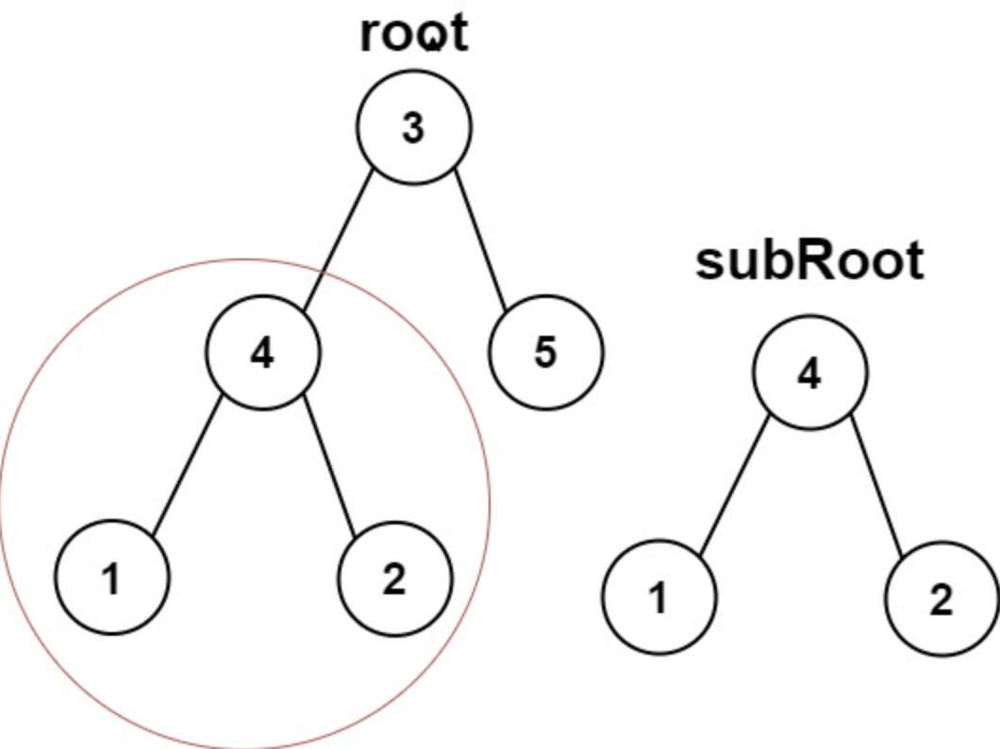

## Link
[Subtree of Another Tree - LeetCode](https://leetcode.com/problems/subtree-of-another-tree/description/) - easy
## Question
>Given the roots of two binary trees `root` and `subRoot`, return `true` if there is a subtree of `root` with the same structure and node values of `subRoot` and `false` otherwise. A subtree of a binary tree `tree` is a tree that consists of a node in `tree` and all of this node's descendants. The tree `tree` could also be considered as a subtree of itself.
>
>**Example 1:**<br>
> <br>
>**Input:** root = [3,4,5,1,2], subRoot = [4,1,2]<br>
>**Output:** true<br>
## Goal:
-  Determine whether the `subRoot` Tree is a subtree of `Root` tree.
## Logic:
1. Traverse the main tree node by node
2. At each node, check if the subtree's root is identical to main tree node
3. use helper function `isSameTree` to compare
4. return True as soon as a math is found
## Code:
```python
# Definition for a binary tree node.
# class TreeNode:
#     def __init__(self, val=0, left=None, right=None):
#         self.val = val
#         self.left = left
#         self.right = right
class Solution:
    def isSubtree(self, root: Optional[TreeNode], subRoot: Optional[TreeNode]) -> bool:
        if not root:
            return False
        
        if self.isSameTree(root, subRoot):
            return True
        
        return self.isSubtree(root.left, subRoot) or self.isSubtree(root.right, subRoot)

    def isSameTree(self, tree1, tree2):
        if not tree1 and not tree2:
            return True
        if not tree1 or not tree2:
            return False
        if tree1.val != tree2.val:
            return False
        
        return self.isSameTree(tree1.left, tree2.left) and self.isSameTree(tree1.right, tree2.right)
```

## Complexity analysis
Time Complexity: `O(m*n)`<br>
Space Complexity: `O(m*n)`
## Sample: 

## Pre-knowledge
- tree
